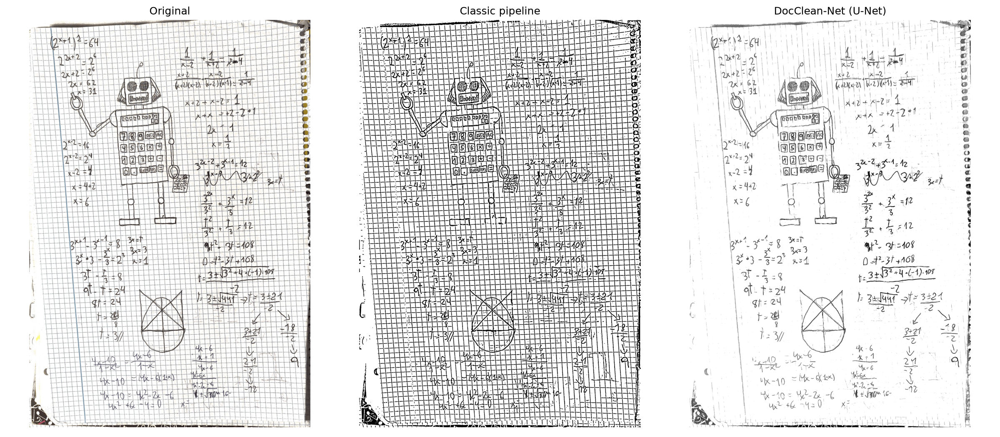
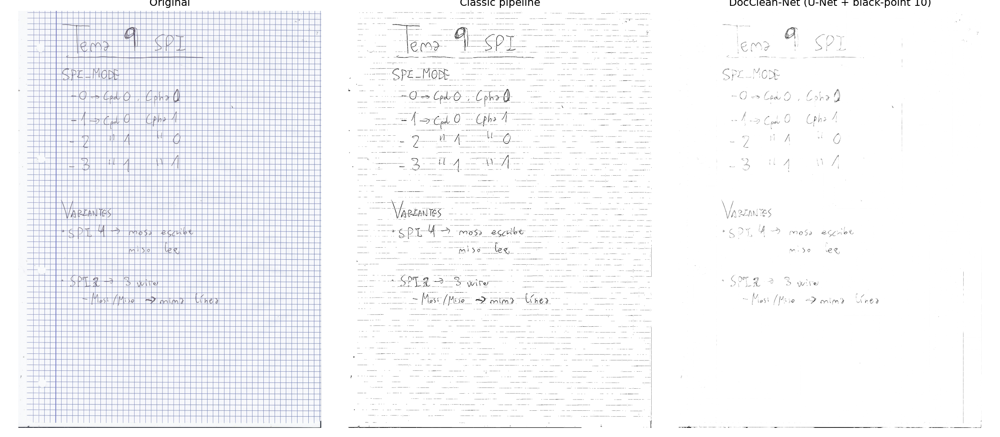
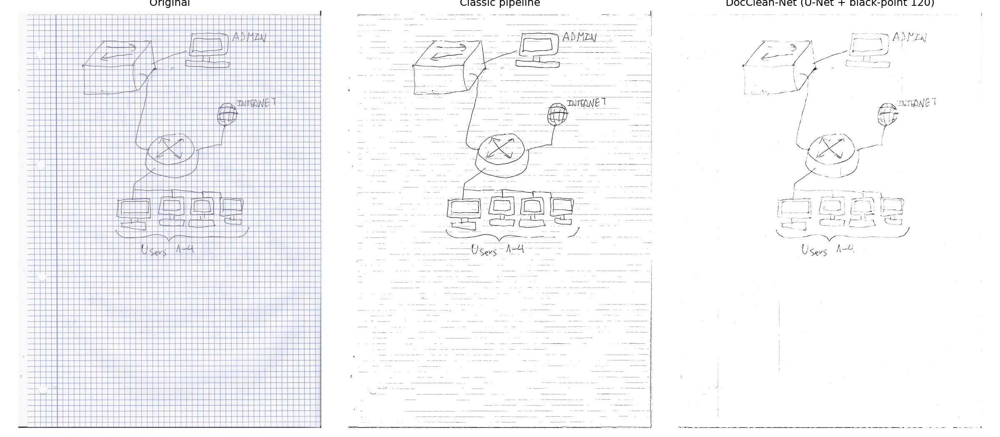
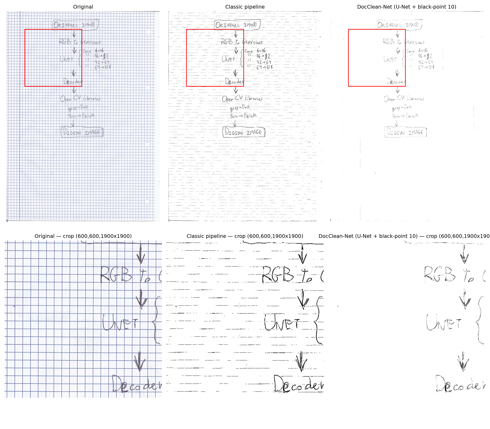

# DocClean-Net

[](https://github.com/olijuseju/DocClean-Net/actions/workflows/ci.yml)

[](LICENSE)

Removes structured backgrounds — blue grid lines, ruled lines, watermarks — from scanned handwritten documents, so notes taken on graph paper come out as clean digital pages.

Two independent approaches, built side by side on purpose: a deterministic classical computer-vision pipeline, and a lightweight U-Net trained on procedurally generated synthetic data. The comparison between them is the point of this project as much as either result on its own.

## Demo


*Dense printed grid removed completely, faint pencil arrows preserved in the zoomed crop — the model's whole contract in one image: strip structure, keep deliberate strokes. Generated with `scripts/visualize_results.py`, which applies the same black-point finishing pass (`scripts/boost_black.py`) as the GUI, so this matches what a person actually gets.*


*Where the classic pipeline struggles most: dense ruled-line pages turn into speckled noise under adaptive thresholding, while DocClean-Net stays legible. The strongest single argument in this repo for training a network instead of hand-tuning thresholds.*



*Not a flatbed scan — a phone-camera photo. Confirms the domain-robustness work (real-background compositing over 6 real paper/lighting domains, see [Technical lessons](#technical-lessons)) generalizes beyond scanner input.*



*Faint ballpoint on a washed-out page: the classic pipeline collapses into noise, DocClean-Net holds up. Not to be confused with the genuine low-contrast failure mode documented under [Known limitations](#known-limitations) below — this particular case the network handles fine.*




*A hand-drawn diagram of this project's own architecture, cleaned by the project's own network — original → classic pipeline → DocClean-Net, then a zoomed crop on the RGB→grayscale→U-Net→decoder chain.*

More examples in [`docs/`](docs).

## Why this exists

Scanned notebook pages with printed grid or ruled lines are hard to digitize cleanly: simple thresholding either keeps the grid or eats the handwriting, because both are dark marks on light paper at similar intensity. This project tackles that with two contrasting strategies:

- **Classic pipeline** — a fully deterministic, explainable OpenCV/NumPy pipeline. No training, no black box; every step is a named, inspectable operation.
- **DocClean-Net (U-Net)** — a small (482,449-parameter) neural network trained entirely on synthetic data, learning to separate ink from structured background as a general pattern rather than through hand-tuned thresholds.

Neither approach is presented as strictly "better" — the [Results](#results) section shows where each wins.

## How it works

### Classic pipeline (`classic_pipeline/digitize_notebook.py`)

Six deterministic steps, frozen and unit-tested:

1. **Synthetic B−R channel** — the blue grid separates from dark ink better in a custom Blue-minus-Red channel than in HSV saturation, since grid-blue and ink-black are both low-saturation but differ in the B−R sign.
2. **Adaptive thresholding** — a single adaptive threshold (no fusion with a global threshold) on that channel.
3. **Connected-component noise cleanup** — removes small spurious ink components by connected-component area filtering, not morphological opening (opening erodes thin strokes along with noise; component filtering only removes what's genuinely too small to be a stroke).
4. Grid/line mask subtraction from the ink mask.
5. Border/edge cleanup.
6. Output composition (paper white, ink black).

### DocClean-Net (`model/unet.py`)

```
Input:  (B, 1, 256, 256)  grayscale, float32 [0,1]   — raw grayscale, not the B-R channel
Encoder:     ConvBlock(1→16)  + MaxPool
             ConvBlock(16→32) + MaxPool
             ConvBlock(32→64) + MaxPool
Bottleneck:  ConvBlock(64→128)
Decoder:     ConvTranspose + skip + ConvBlock  ×3   (mirrors the encoder)
Output:      Conv(16→1) + Sigmoid → (B, 1, 256, 256)

Trainable parameters: 482,449
Loss: 0.7 · MSE + 0.3 · (1 − SSIM)
```

The network deliberately receives raw grayscale rather than the classic pipeline's engineered B−R channel — the two approaches don't share features, by design, so the comparison in [Results](#results) is a fair one between "hand-engineered signal" and "learned end-to-end."

## Data

10,000 synthetic 512×512 dirty/clean image pairs, generated procedurally: simulated paper texture, synthetic handwriting strokes, and degradations (blue grid, ruled lines, watermarks) composited on top with randomized parameters (`data/generators/`). No real handwriting is used for training — every real scan the model sees at inference time is out-of-sample.

Trained on a Colab T4 GPU, 50 epochs, ~3.9 hours total. Best checkpoint at **epoch 37**, `val_loss = 0.000805`. Full per-epoch loss curve in [`checkpoints/train_log.csv`](checkpoints/train_log.csv).

## Results

Benchmarked on 11 real handwritten scans (~1700×2338 px, blue grid, ballpoint pen), never used in training or calibration. CPU-only.

| Metric | Classic pipeline | DocClean-Net | Notes |
|---|---|---|---|
| SSIM | (reference) | 0.80 ± 0.02 | DL measured against the classic pipeline's output as reference — there is no ground truth on real scans (n=11) |
| PSNR (dB) | (reference) | 13.6 ± 0.6 | |
| BRISQUE | 151.9 | 87.0 | Lower is better; relative comparison only — BRISQUE is trained on natural-image statistics, so binarized documents score high in absolute terms regardless of quality |
| Ink coverage (%) | 8.1 | 4.1 | The gap is stroke thickness (the classic pipeline binarizes the full antialiased pen outline), not content loss — the DL/classic ratio is stable at 0.44–0.55 across all 11 images |
| Time (ms/page) | 7,154 | 4,552 | DocClean-Net is ~1.6× faster on CPU and much more stable (±0.2 s) |

**Reading the numbers honestly**: SSIM/PSNR compare a binary output against a continuous one, so ~0.80 SSIM is a reasonable result, not a weak one. BRISQUE only tells you which of the two is relatively less "unnatural" — the absolute values mean little for scanned text. The ink-coverage gap looks alarming out of context but is cosmetic: it tracks stroke width, not missing handwriting.

Full metrics: [`benchmark_results/metrics.csv`](benchmark_results/metrics.csv), plots in the same directory.

## Known limitations

Two real failure modes surfaced while generating demo images, documented here rather than cropped out of the picture:


**Domain gap with phone-camera scanning apps.** The scan above was captured with a phone scanning app (Google Drive Scan), not a flatbed scanner. Its auto-perspective-correction leaves an uneven-illumination shadow gradient the synthetic training data — flat, uniformly lit paper — never modeled. Both pipelines produce a solid dark region there instead of clean paper; DocClean-Net's is smaller than the classic pipeline's but still a real failure, not a subtle metric gap.


**Very low ink/background contrast.** On faint pencil writing, the grid is barely removed — the network's confidence in what counts as "ink" seems to degrade when the intensity gap between ink and grid is small, closer to the noise floor than anything in the synthetic training distribution.

Both are plausibly a training-data coverage gap rather than an architecture problem — the synthetic generator doesn't currently model uneven scan-app illumination or very-low-contrast writing. Flagged as future work rather than fixed here, to avoid reopening the frozen training pipeline without a deliberate, scoped decision to do so.

## Technical lessons

**Why the sigmoid never saturates, and what to do about it instead of retraining.** The trained network's sigmoid output plateaus around ~233, never 255 — visible as a faint residual grid ghost under the paper. Root cause is twofold: MSE loss averages over plausible outputs rather than committing to an extreme (the literature generally prefers L1 for restoration for this reason), and the synthetic "clean" targets themselves have paper at a mean of ~245, not 255. Retraining with L1 was evaluated and rejected — the cost was high and it wouldn't fix the second cause on its own. The fix that shipped instead is deterministic post-processing: estimate the paper level as the image's histogram mode minus a small margin, then linearly stretch that level to pure white (`white_point="auto"` in `predict_image()`, on by default). `white_point=None` exposes the raw network output, which the interactive GUI uses to cache the (slow) network pass once and recompute the (cheap) post-processing live.

**BRISQUE isn't in scikit-image** — a wrong assumption from early planning. It's implemented in `piq` (pure PyTorch) instead. `piq.brisque` raises an `AssertionError` on near-constant images (e.g. a stroke-free binarized page), handled by returning `NaN` and excluding it from summary means.

**Post-processing order matters, empirically, not just intuitively**: denoise (remove small connected-component dots) must run *before* thicken (morphological stroke thickening), not after. Thickening a 1px noise dot first inflates it past the area filter's threshold — verified on a real test image: 532 residual noise components with thicken-first, versus 183 with denoise-first.

## Installation

```bash
git clone https://github.com/olijuseju/DocClean-Net.git
cd DocClean-Net
python -m venv .venv
.venv\Scripts\Activate.ps1        # Windows PowerShell
# source .venv/bin/activate       # macOS/Linux

pip install -r requirements.txt
python scripts/download_model.py  # fetches the trained checkpoint (~1.9 MB) from GitHub Releases
```

For development (tests, linting, notebooks): `pip install -r requirements-dev.txt`.

Tested on Python 3.10, 3.11, and 3.13, identical results on all three.

## Usage

**Single command, full pipeline** (U-Net + denoise + stroke thickening):
```bash
python -m scripts.run_pipeline --model checkpoints/best.pt --input scan.png --output result.png
# or a whole folder, batch mode:
python -m scripts.run_pipeline --model checkpoints/best.pt --input data/real_test/ --output out/
```

**U-Net inference only**:
```bash
python -m inference.predict --model checkpoints/best.pt --input scan.png --output result.png --white-point auto
```

**Benchmark, DL vs. classic**:
```bash
python -m inference.benchmark --model checkpoints/best.pt --test-dir data/real_test/
```

**Before/after comparison figure** (used to generate this README's demo images):
```bash
python scripts/visualize_results.py -i scan.png -m checkpoints/best.pt -o comparison.png --crop 200 200 500 500
```

**Interactive GUIs** — two, side by side:
```bash
docclean-gui             # classic pipeline, manual paint/erase touch-up
docclean-inference-gui   # U-Net pipeline: live sliders for white point, dot area,
                          # ink threshold, stroke thickness; synchronized zoom/pan;
                          # batch processing; thumbnail navigation
```
The U-Net GUI runs the (slow) network pass once per image and caches the raw output; every slider only recomputes the (cheap) post-processing on top, applied on demand via "Apply changes" rather than live on drag. UX polish (layout, first-run experience) is planned future work.

## Interactive GUI


Beyond the command line, DocClean-Net ships an interactive desktop app for
tuning results page by page. The window shows the original scan and the
restored output side by side, with **synchronised zoom and pan** — zoom into a
region on either panel and the other follows, so you can inspect the same
patch of ink before and after at any magnification. Post-processing is driven
by sliders paired with numeric entries (white point, speckle removal, ink
threshold, stroke thickness); nothing recomputes until you press **Apply**, so
you can dial in several parameters and evaluate them as one change.

The design point that makes this practical: sliding-window U-Net inference is
the slow step (~4.5 s per page on CPU), so it runs **once per image** on a
background thread and its raw output is cached. Every subsequent parameter
tweak only re-runs the post-processing stage on that cache, which is a
millisecond-scale operation. Loaded pages appear in a clickable thumbnail
strip with a ✓ marker once processed, and can be navigated with the arrow
keys or by jumping to a page number. **Process all** runs inference across the
whole batch with a progress bar, and **Save all** exports every page with the
current settings applied.

```bash
python -m gui.inference_gui --model checkpoints/best.pt
```

A separate GUI for the classic pipeline lives in `gui/digitize_gui.py`
(`docclean-gui`), including a manual paint layer for touch-ups.

## Repository structure

```
classic_pipeline/   Frozen deterministic OpenCV/NumPy pipeline
data/                Synthetic dataset generation (paper, strokes, degradations)
model/               U-Net architecture, training loop, loss
inference/           Sliding-window inference, benchmarking, shared I/O
scripts/             CLI entry points: run_pipeline, thicken_strokes,
                     visualize_results, download_model
gui/                 Two interactive Tkinter GUIs (classic + U-Net)
tests/               170+ tests, pytest
checkpoints/         train_log.csv (committed); best.pt (gitignored, see Installation)
benchmark_results/   metrics.csv + plots from the 11-scan benchmark
docs/                Demo and limitation figures used in this README
notebooks/           Colab training notebook
```

## Testing

```bash
pytest -m "not slow" -v      # fast suite, no network required
pytest -v                    # includes the slow, network-dependent download test
```

170 fast tests + 4 slow, green on Windows (Python 3.11 and 3.13) and in CI (Python 3.10 and 3.11, Ubuntu).

## Future work

- **Domain-robust training data** — extend the synthetic generator with uneven-illumination/shadow augmentation (see [Known limitations](#known-limitations)) to close the gap with phone-scanning-app input, rather than only with flatbed scans.
- **Stroke refinement via Google Quick Draw!** — using the Quick Draw! dataset to train a dedicated stroke-thickening/refinement module, as an alternative to the current morphological thickening step.
- **L1 loss retraining** — evaluated and rejected once already (see [Technical lessons](#technical-lessons)); could be revisited alongside the domain-robustness work above rather than in isolation.
- **More degradation types** — coffee stains, fold creases, fainter pencil (see the low-contrast limitation above).

## License

MIT — see [LICENSE](LICENSE).
