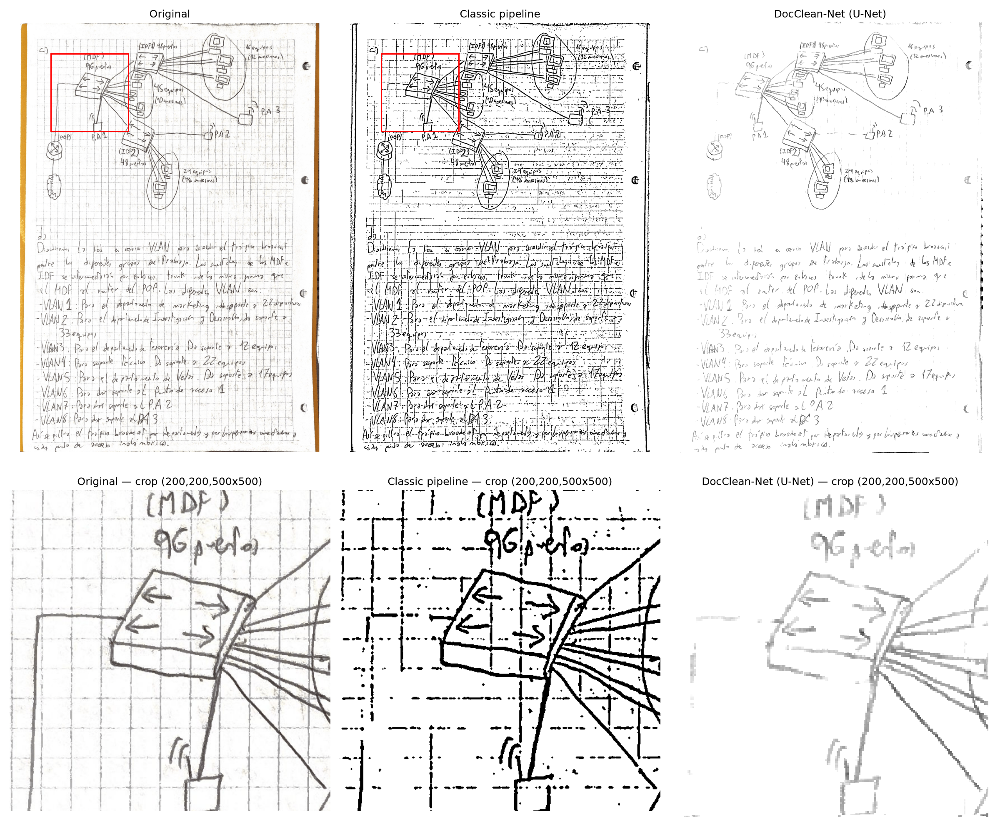
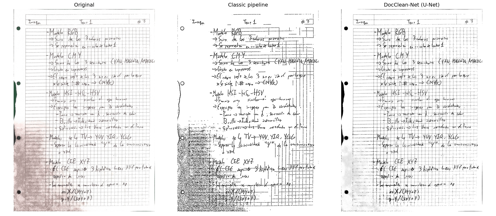
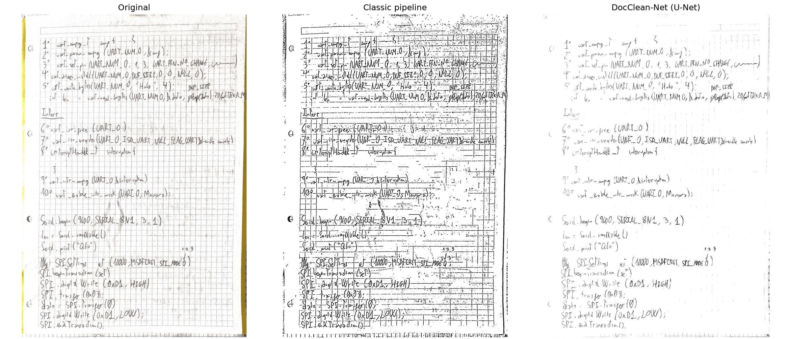
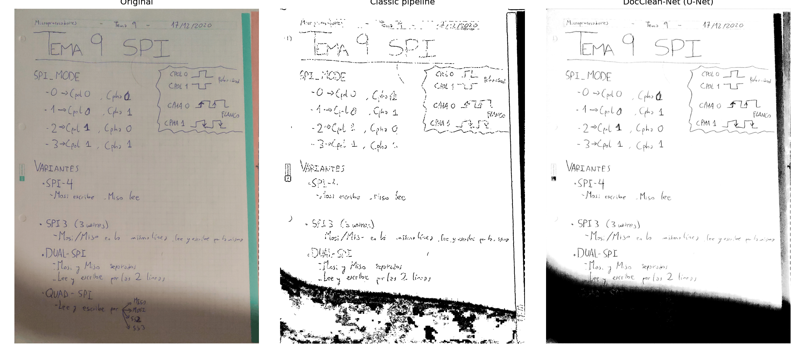
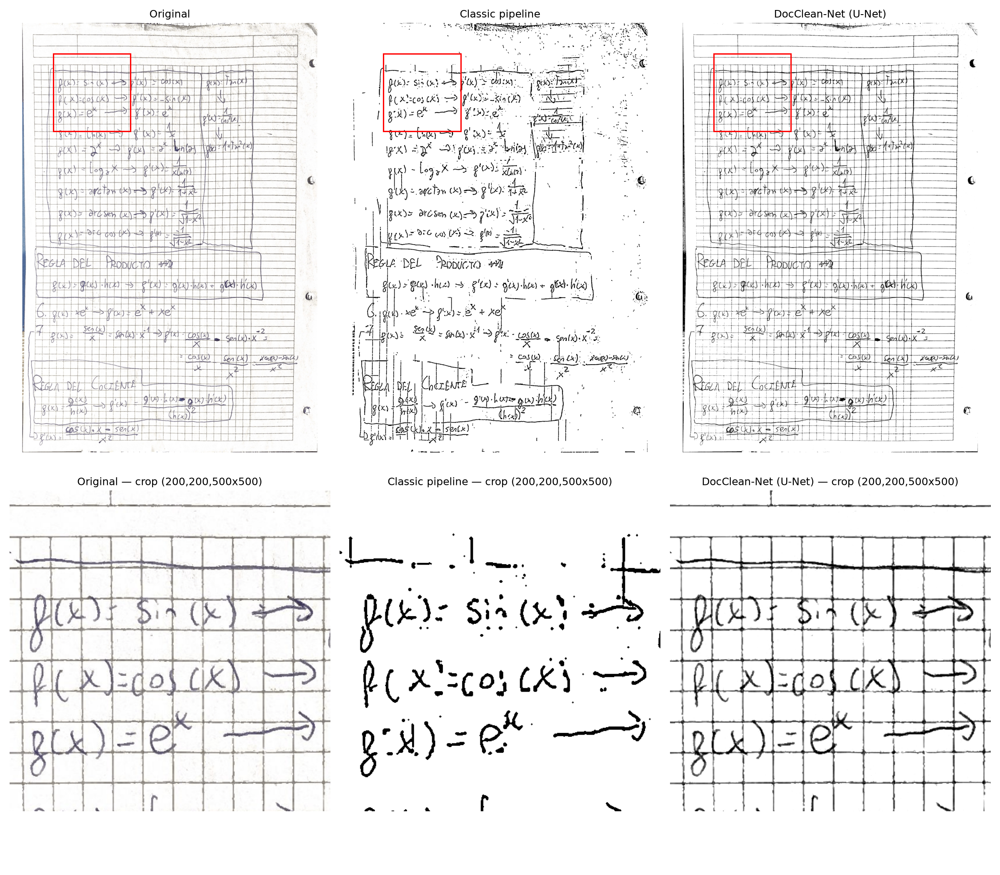
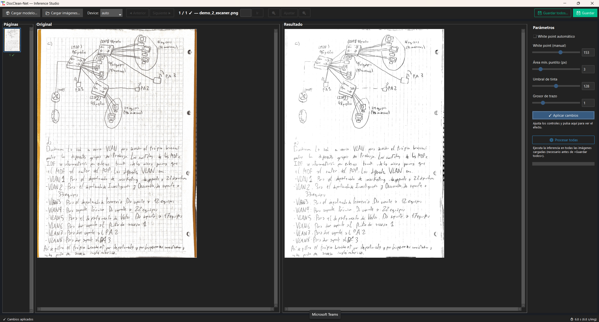

# DocClean-Net

[](https://github.com/olijuseju/DocClean-Net/actions/workflows/ci.yml)

[](LICENSE)

Removes structured backgrounds — blue grid lines, ruled lines, watermarks — from scanned handwritten documents, so notes taken on graph paper come out as clean digital pages.

Two independent approaches, built side by side on purpose: a deterministic classical computer-vision pipeline, and a lightweight U-Net trained on procedurally generated synthetic data. The comparison between them is the point of this project as much as either result on its own.

## Demo



*Original → classic pipeline → DocClean-Net, with a zoomed detail crop showing stroke fidelity next to the removed grid. More examples in [`docs/`](docs).*




## Why this exists

Scanned notebook pages with printed grid or ruled lines are hard to digitize cleanly: simple thresholding either keeps the grid or eats the handwriting, because both are dark marks on light paper at similar intensity. This project tackles that with two contrasting strategies:

- **Classic pipeline** — a fully deterministic, explainable OpenCV/NumPy pipeline. No training, no black box; every step is a named, inspectable operation.
- **DocClean-Net (U-Net)** — a small (482,449-parameter) neural network trained entirely on synthetic data, learning to separate ink from structured background as a general pattern rather than through hand-tuned thresholds.

Neither approach is presented as strictly "better" — the [Results](#results) section shows where each wins.

## How it works

### Classic pipeline (`classic_pipeline/digitize_notebook.py`)

Six deterministic steps, frozen and unit-tested:

1. **Synthetic B−R channel** — the blue grid separates from dark ink better in a custom Blue-minus-Red channel than in HSV saturation, since grid-blue and ink-black are both low-saturation but differ in the B−R sign.
2. **Adaptive thresholding** — a single adaptive threshold (no fusion with a global threshold) on that channel.
3. **Connected-component noise cleanup** — removes small spurious ink components by connected-component area filtering, not morphological opening (opening erodes thin strokes along with noise; component filtering only removes what's genuinely too small to be a stroke).
4. Grid/line mask subtraction from the ink mask.
5. Border/edge cleanup.
6. Output composition (paper white, ink black).

### DocClean-Net (`model/unet.py`)

```
Input:  (B, 1, 256, 256)  grayscale, float32 [0,1]   — raw grayscale, not the B-R channel
Encoder:     ConvBlock(1→16)  + MaxPool
             ConvBlock(16→32) + MaxPool
             ConvBlock(32→64) + MaxPool
Bottleneck:  ConvBlock(64→128)
Decoder:     ConvTranspose + skip + ConvBlock  ×3   (mirrors the encoder)
Output:      Conv(16→1) + Sigmoid → (B, 1, 256, 256)

Trainable parameters: 482,449
Loss: 0.7 · MSE + 0.3 · (1 − SSIM)
```

The network deliberately receives raw grayscale rather than the classic pipeline's engineered B−R channel — the two approaches don't share features, by design, so the comparison in [Results](#results) is a fair one between "hand-engineered signal" and "learned end-to-end."

## Data

The synthetic generator (`data/generators/`) composites simulated paper texture, synthetic handwriting strokes, and degradations (blue grid, ruled lines, watermarks, bleed-through) with randomized parameters. Two training runs so far:

- **v1.0** (Phase 2): 10,000 pairs, 512×512, flat/uniformly-lit synthetic paper only. 50 epochs, Colab T4, best checkpoint at **epoch 37**, `val_loss = 0.000805` ([`checkpoints/train_log_v1.0.csv`](checkpoints/train_log_v1.0.csv)).
- **v1.1** (Phase 5): extended the generator with non-uniform illumination fields and real background tiles harvested from real scanned/photographed paper (`scripts/harvest_backgrounds.py`), aimed at closing the domain gap described in [Known limitations](#known-limitations). 50 epochs, best checkpoint at **epoch 49**, `val_loss = 0.006773` ([`checkpoints/train_log_v1.1.csv`](checkpoints/train_log_v1.1.csv)).

The v1.1 validation loss is roughly 8× higher than v1.0's — **this is not a regression**, it's a harder validation set: v1.1 trains and validates against realistic illumination variation and real paper textures that v1.0 never had to handle, so the two numbers aren't comparable at face value. What matters is real-world behavior, covered honestly in [Known limitations](#known-limitations) below — the extra training-data variety was a deliberate attempt to close a specific domain gap, and it's reported there whether or not it actually did.

No real handwriting is used for training either version — only backgrounds/paper texture in v1.1 come from real sources; strokes are still synthetic.

## Results

Benchmarked on 11 real handwritten scans (~1700×2338 px, blue grid, ballpoint pen), never used in training or calibration. CPU-only. Figures below are from the v1.0 benchmark run ([`benchmark_results/metrics.csv`](benchmark_results/metrics.csv)); not yet re-run against v1.1.

| Metric | Classic pipeline | DocClean-Net | Notes |
|---|---|---|---|
| SSIM | (reference) | 0.80 ± 0.02 | DL measured against the classic pipeline's output as reference — there is no ground truth on real scans (n=11) |
| PSNR (dB) | (reference) | 13.6 ± 0.6 | |
| BRISQUE | 151.9 | 87.0 | Lower is better; relative comparison only — BRISQUE is trained on natural-image statistics, so binarized documents score high in absolute terms regardless of quality |
| Ink coverage (%) | 8.1 | 4.1 | The gap is stroke thickness (the classic pipeline binarizes the full antialiased pen outline), not content loss — the DL/classic ratio is stable at 0.44–0.55 across all 11 images |
| Time (ms/page) | 7,154 | 4,552 | DocClean-Net is ~1.6× faster on CPU and much more stable (±0.2 s) |

**Reading the numbers honestly**: SSIM/PSNR compare a binary output against a continuous one, so ~0.80 SSIM is a reasonable result, not a weak one. BRISQUE only tells you which of the two is relatively less "unnatural" — the absolute values mean little for scanned text. The ink-coverage gap looks alarming out of context but is cosmetic: it tracks stroke width, not missing handwriting.

## Known limitations

Two real failure modes surfaced while generating demo images in Phase 4, and **remain unresolved after the Phase 5 domain-robustness retrain (v1.1)** — documented honestly rather than quietly dropped once they turned out to be harder than expected:



**Domain gap with phone-camera scanning apps.** The scan above was captured with a phone scanning app (Google Drive Scan), not a flatbed scanner. Its auto-perspective-correction leaves an uneven-illumination shadow gradient. v1.1 added non-uniform illumination fields and real harvested backgrounds to training specifically to address this — verified against this exact image, and it still produces the same solid dark region instead of clean paper. Either the added training variety doesn't cover this specific illumination pattern closely enough, or the failure has a different root cause than a training-data gap; not yet diagnosed further.



**Very low ink/background contrast.** On faint pencil writing, the grid is still barely removed under v1.1, same as v1.0. This looks less related to illumination/background variety and more to how confidently the network separates "ink" from "grid" when their intensity gap is small — a different problem from the one v1.1's training changes targeted, which may be why it didn't move.

## Technical lessons

**Why the sigmoid never saturates, and what to do about it instead of retraining.** The trained network's sigmoid output plateaus around ~233, never 255 — visible as a faint residual grid ghost under the paper. Root cause is twofold: MSE loss averages over plausible outputs rather than committing to an extreme (the literature generally prefers L1 for restoration for this reason), and the synthetic "clean" targets themselves have paper at a mean of ~245, not 255. Retraining with L1 was evaluated and rejected — the cost was high and it wouldn't fix the second cause on its own. The fix that shipped instead is deterministic post-processing: estimate the paper level as the image's histogram mode minus a small margin, then linearly stretch that level to pure white (`white_point="auto"` in `predict_image()`, on by default), plus a complementary black-point pass (`scripts/boost_black.py`) that darkens the ink side symmetrically. `white_point=None` exposes the raw network output, which the interactive GUI uses to cache the (slow) network pass once and recompute the (cheap) post-processing live.

**BRISQUE isn't in scikit-image** — a wrong assumption from early planning. It's implemented in `piq` (pure PyTorch) instead. `piq.brisque` raises an `AssertionError` on near-constant images (e.g. a stroke-free binarized page), handled by returning `NaN` and excluding it from summary means.

**Post-processing order matters, empirically, not just intuitively**: denoise (remove small connected-component dots) must run *before* thicken (morphological stroke thickening), not after. Thickening a 1px noise dot first inflates it past the area filter's threshold — verified on a real test image: 532 residual noise components with thicken-first, versus 183 with denoise-first.

**More training-data variety doesn't automatically fix a specific failure mode.** v1.1 was a deliberate, scoped attempt to close the two gaps above by adding illumination/background variety to training — and it didn't move either one. That's a useful negative result: it suggests the shadow-artifact and low-contrast failures need direct diagnosis (what does the raw, pre-post-processing network output actually look like on these inputs?) rather than more of the same kind of data.

## Installation

```bash
git clone https://github.com/olijuseju/DocClean-Net.git
cd DocClean-Net
python -m venv .venv
.venv\Scripts\Activate.ps1        # Windows PowerShell
# source .venv/bin/activate       # macOS/Linux

pip install -r requirements.txt
python scripts/download_model.py  # fetches the trained checkpoint (v1.1, ~1.9 MB) from GitHub Releases
```

For development (tests, linting, notebooks): `pip install -r requirements-dev.txt`.

Tested on Python 3.10, 3.11, and 3.13, identical results on all three.

## Usage

**Single command, full pipeline** (U-Net + denoise + stroke thickening):
```bash
python -m scripts.run_pipeline --model checkpoints/best.pt --input scan.png --output result.png
# or a whole folder, batch mode:
python -m scripts.run_pipeline --model checkpoints/best.pt --input data/real_test/ --output out/
```

**U-Net inference only**:
```bash
python -m inference.predict --model checkpoints/best.pt --input scan.png --output result.png --white-point auto
```

**Benchmark, DL vs. classic**:
```bash
python -m inference.benchmark --model checkpoints/best.pt --test-dir data/real_test/
```

**Before/after comparison figure** (used to generate this README's demo images):
```bash
python scripts/visualize_results.py -i scan.png -m checkpoints/best.pt -o comparison.png --crop 200 200 500 500
```

**Harvest real background tiles for training** (not committed to git — regenerate locally):
```bash
python scripts/harvest_backgrounds.py --input-dir path/to/scans --output-dir data/real_backgrounds
```

## Interactive GUI



Two Tkinter GUIs ship with the project, one per pipeline:

```bash
docclean-gui             # classic pipeline: manual paint/erase touch-up on the deterministic output
docclean-inference-gui   # U-Net pipeline: full interactive control over post-processing
```

The U-Net GUI (`gui/inference_gui.py` + `gui/inference_core.py`) is more than a thin wrapper around `predict_image()` — it's built around a specific performance trade-off: the network pass is slow and only needs to run once per image, while post-processing (white point, denoise, thicken) is cheap and benefits from being tweaked interactively. So the raw U-Net output is computed once per image, in a background thread, and cached; every slider (white point, dot area, ink threshold, stroke thickness) only recomputes the cheap post-processing on top, applied on demand via "Apply changes" rather than live on every drag.

Beyond that core design:
- Synchronized zoom/pan between the Original and Result panels
- Batch mode — process a whole folder, "Process all" / "Save all"
- Thumbnail panel with per-image processed/unprocessed markers, jump-to-page
- Remembers the last checkpoint path between sessions
- Optional drag-and-drop (`tkinterdnd2`), keyboard shortcuts (←/→, Ctrl+S, Enter)
- PyTorch errors translated into actionable messages instead of raw tracebacks

The GUI's core post-processing logic (`gui/inference_core.py`) is tested (tkinter itself isn't importable headlessly in CI, same reason `digitize_gui.py` has no direct tests); the interactive layer was validated by inspection plus a full manual pass on a real machine, since it was originally written without a display available in the dev environment. UX polish (first-run experience, layout refinement) is planned future work.

## Repository structure

```
classic_pipeline/   Frozen deterministic OpenCV/NumPy pipeline
data/                Synthetic dataset generation (paper, strokes, degradations, illumination)
model/               U-Net architecture, training loop, loss
inference/           Sliding-window inference, benchmarking, shared I/O
scripts/             CLI entry points: run_pipeline, thicken_strokes, boost_black,
                     visualize_results, download_model, harvest_backgrounds
gui/                 Two interactive Tkinter GUIs (classic + U-Net)
tests/               230+ tests, pytest
checkpoints/         train_log_v1.0.csv, train_log_v1.1.csv (committed);
                     best.pt (gitignored, see Installation — currently v1.1)
benchmark_results/   metrics.csv + plots (v1.0 benchmark run)
docs/                Demo and limitation figures used in this README
notebooks/           Colab training notebook
```

## Testing

```bash
pytest -m "not slow" -v      # fast suite, no network required
pytest -v                    # includes the slow, network-dependent download test
```

Green on Windows (Python 3.11 and 3.13) and in CI (Python 3.10 and 3.11, Ubuntu).

## Future work

- **Diagnose the two remaining failure modes directly** — v1.1's added data variety didn't fix either the shadow-artifact or low-contrast case (see [Known limitations](#known-limitations)); next step is inspecting the raw network output on these specific inputs before deciding whether it's an architecture, loss, or data-representation issue rather than adding more synthetic variety blindly.
- **Re-run the 11-scan benchmark against v1.1** — the [Results](#results) table above is still from the v1.0 checkpoint.
- **Stroke refinement via Google Quick Draw!** — using the Quick Draw! dataset to train a dedicated stroke-thickening/refinement module, as an alternative to the current morphological thickening step.
- **L1 loss retraining** — evaluated and rejected once already (see [Technical lessons](#technical-lessons)).
- **More degradation types** — coffee stains, fold creases.

## License

MIT — see [LICENSE](LICENSE).
